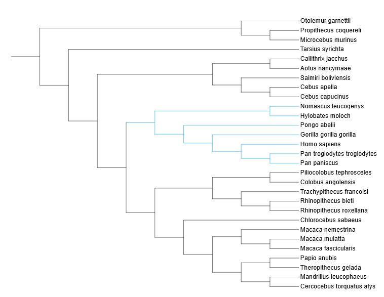

## Examining Evolution of Starch Metabolism in Primates
### *Audrey Tjahjadi*
--------------------

### Overview

This is the project site for my final project for Intro to Bioinformatics. This project will examine the evolutionary history of two starch-metabolizing enzymes, maltase-glucoamylase and sucrase-isomaltase, in the primate clade. The analysis will utilize techniques such as multiple sequence alignment and generation of phylogenetic trees and give additional practice for implementing these techniques.  

### Genes of Interest


### Primate Species

The analysis will include DNA sequences taken from Genbank for the 29 species of primate shown in the tree below. Highlighted in blue is the clade containing the great apes and humans.  



### Referenced Resources and Software
#### Literature
1. Janeike 2016
2.
3.
4.

#### Software and Other Resources
1. Genbank
2. MEGAX
3. Datamonkey
Wayne Delport, Art F. Poon, Simon D. W. Frost and Sergei L. Kosakovsky Pond
Datamonkey 2010: a suite of phylogenetic analysis tools for evolutionary biology
Bioinformatics 2010 July 29[Epub ahead of print; PMID: 20671151] 
4. ClustalOmega, EMBL-EBI
Madeira F, Park YM, Lee J, et al. The EMBL-EBI search and sequence analysis tools APIs in 2019. Nucleic Acids Research. 2019 Jul;47(W1):W636-W641. DOI: 10.1093/nar/gkz268. 


## Welcome to GitHub Pages

You can use the [editor on GitHub](https://github.com/teriyakiaud/SI-and-MGAM-Evolution/edit/gh-pages/index.md) to maintain and preview the content for your website in Markdown files.

Whenever you commit to this repository, GitHub Pages will run [Jekyll](https://jekyllrb.com/) to rebuild the pages in your site, from the content in your Markdown files.

### Markdown

Markdown is a lightweight and easy-to-use syntax for styling your writing. It includes conventions for


- Bulleted
- List

1. Numbered
2. List

**Bold** and _Italic_ and `Code` text

[Link](url) and 
```

For more details see [GitHub Flavored Markdown](https://guides.github.com/features/mastering-markdown/).

